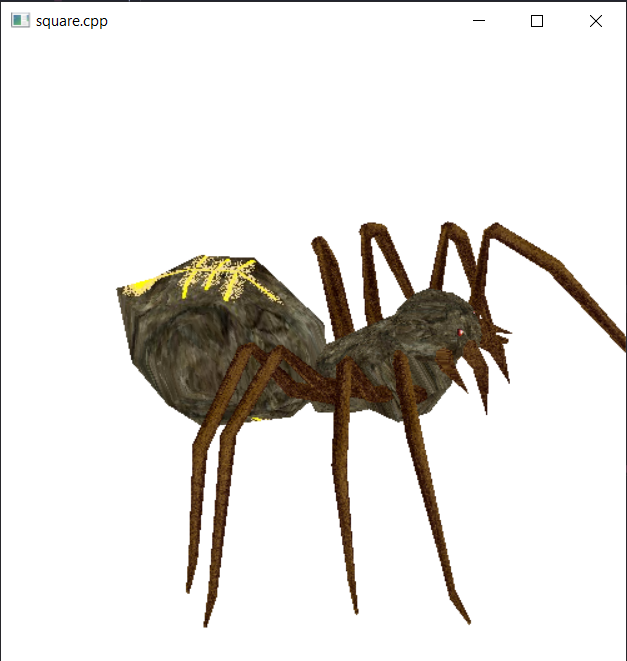
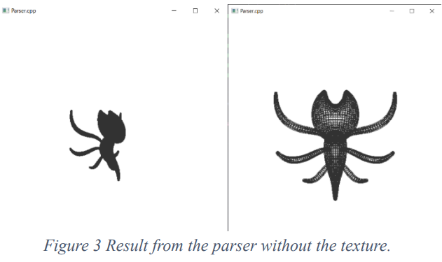
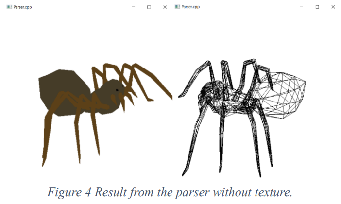
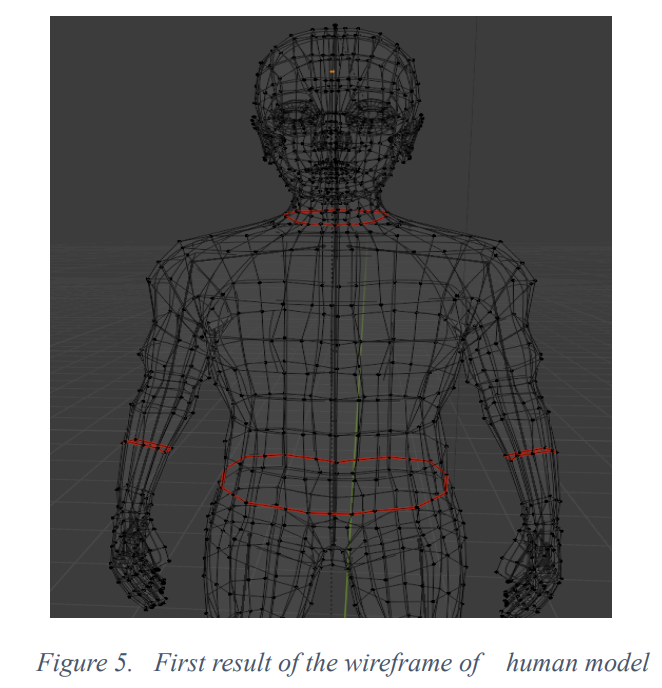
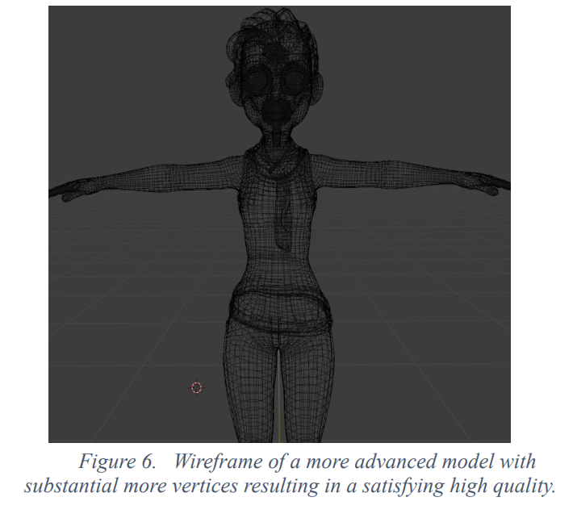
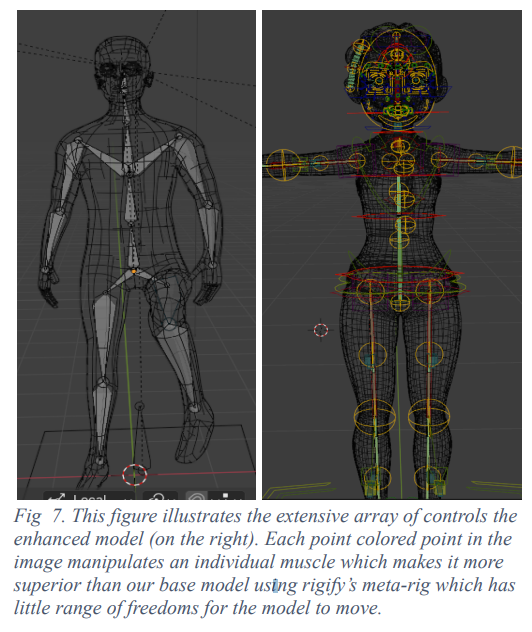

# Skeletal-Animation-for-Parkinson-s-Disease-Simulation

Skeletal Animation with Movement Disorders in Blender and OpenGL

## Abstract

This project explores the creation of realistic character movements in Blender and OpenGL, simulating movement disorders like Parkinson's disease. We use Blender for animation and OpenGL for real-time rendering, creating accurate skeletal models and animations that are validated by comparing them with real patient data. The resulting simulations have applications in computer graphics, healthcare education, and medical training, offering an immersive experience for a better understanding of movement disorders.

## Introduction

In computer graphics, the integration of skeletal animation and the simulation of movement disorders holds the potential to create more realistic and impactful virtual environments. This study focuses on using Blender for character modeling and animation, paired with OpenGL for real-time rendering, to simulate disorders like Parkinson's disease. Our goal is to enhance visual realism in character movement and contribute to the understanding of these disorders, particularly in medical education.

Literature Review
The synergy of Blender and OpenGL allows for the simulation of movement disorders with intricate skeletal animation, enabling realistic movement representation. By utilizing Blender's animation tools and OpenGL's rendering capabilities, we can create dynamic visualizations that serve educational purposes for healthcare professionals. Previous work has explored the use of techniques like skinned instancing and vertex skinning for optimized rendering, and this study continues in that direction, focusing on both computational efficiency and educational potential.

Methodology

## Video Demo
Actions Naming: <>

1- Running:: RIG-Run
2- Walking:: RIG-rainWalk002
3- Sitting:: RIG-rainstonground
4- Jumping:: RIG-Jumping2
5- Parkinson Disorder:: RIG-Disorder1
6- Disorder 2 :: RIG-disorder02 or RIG-disorder02.001  both are the same

https://github.com/user-attachments/assets/feb5227a-f0a7-4626-b308-3c5c856d5915

## OpenGL Integration Process:

Exporting from Blender: Export the model and animation in OpenGL-compatible formats such as .fbx, .obj, or .glTF.
Setting Up OpenGL: Initialize OpenGL context and configure rendering parameters and shaders.
Rendering the Model: Load and render the 3D model in OpenGL, updating transformations based on animation data.
User Interaction: Implement user interaction for scene navigation and visualization.
Validation:
Post-Integration Verification: Ensure accurate translation of skeletal animations from Blender to OpenGL. Seek feedback from medical professionals and end users.
User Testing: Collect user feedback on interactions and overall experience, adjusting the implementation based on insights.
Experiments and Results

## OpenGL and Model Importation:

We initially explored the use of the Assimp library for importing models into OpenGL but faced challenges with dependencies and shader compatibility. Instead, we developed custom parsers for .obj and .mtl formats, achieving satisfactory results in parsing and visualizing 3D models.

## Figures:

| **Figure** | **Description**                                                                                                  | **Image**             |
| ---------- | ---------------------------------------------------------------------------------------------------------------- | --------------------- |
| Figure 1   | Result from custom parser with texture.                                                                          |  |
| Figure 2   | Another result from a custom parser with texture.                                                                  |  |
| Figure 3   | Result from the parser without texture, connected with lines.                                                    |  |
| Figure 4   | Result from the parser without texture, connected with triangles.                                                |  |
| Figure 5   | Wireframe of the initial human body model.                                                                       |  |
| Figure 6   | Wireframe of an advanced model with a significantly higher number of vertices for better quality.                |  |
| Figure 7   | Displaying the advanced model controls, showing manipulation of individual muscles for more detailed animations. |  |

## Blender Human Body Model and Animation:

We began by creating a realistic human model in Blender, utilizing the Rigify tool to create a dynamic skeletal structure that facilitated a range of movements. The model was further enhanced with detailed meshes and fine-tuned facial and muscle controls for more nuanced animation.

## Blender Animation Process:

Character and Skeletal Structure: Build a 3D human model using Blender’s modeling tools, ensuring anatomical accuracy. Set up a skeletal framework using Blender’s armature system, followed by rigging the character.
Animating Movements: Define key poses and set keyframes in Blender for normal and disorder-specific movements. Refine animation curves for smooth and realistic transitions.
Verification and Validation: Compare animated movements with real-life observations to ensure accuracy and realism.
